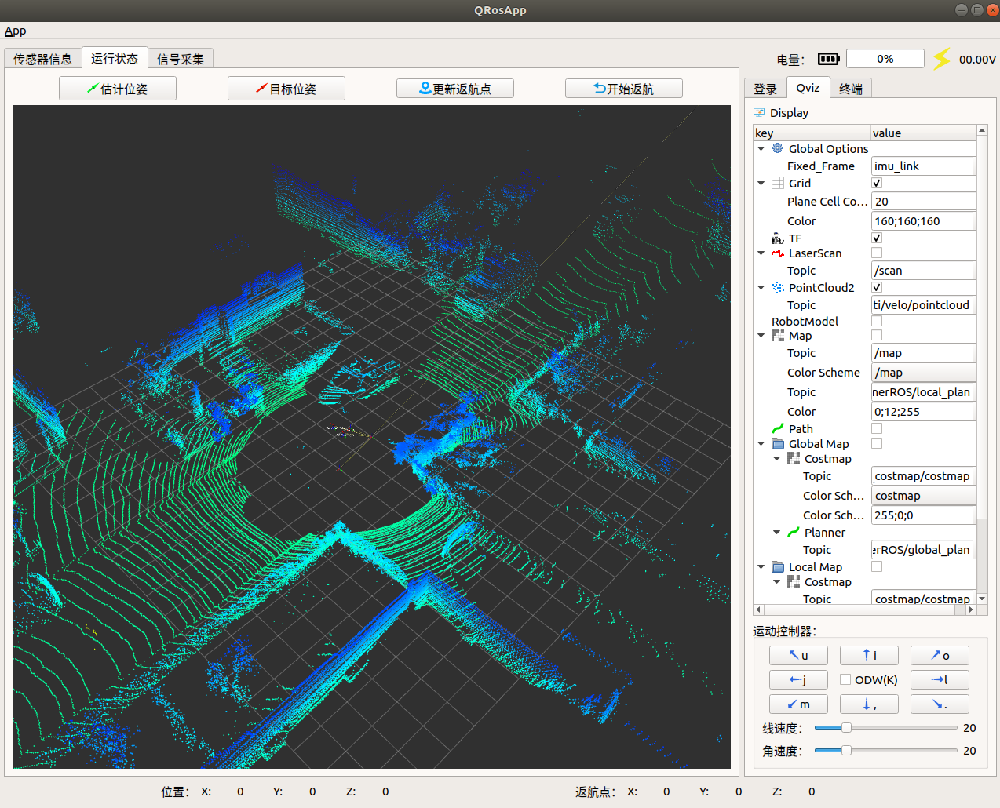

#Robot GUI APP 使用说明

---

## Overview


此项目开始于2023年2月7日，项目内容为一种AGV图形化操作系统，采用ROS2GO开发，开发环境为Ubuntu18.04、ROS melodic、Qt5.9.9，该项目作为23年挑战杯项目的上位机，也是我毕业设计的一部分，目前项目第一阶段任务已完成。

已实现功能：
* 用户登录（上位机IP地址与机载电脑主机名称，支持环境变量登录和保存登录设置）
* 传感器运动信号可视化（线速度、角速度、转向、档位、电池电量）
* 环境信号可视化（空气湿度、空气温度、二氧化碳含量、光照度、雨量、风速）
* 话题更新与可视化（包括话题名和话题类型）
* 图传信号可视化（通过话题名订阅）
* 运行状态可视化与控制（继承rviz部分功能：Grid、TF、LaserScan、PointCloud2、RobotModel、Map、Global Map、Local Map，估计位姿（原2D Pose Estimate）、目标位姿（原2D Nav Goal）、更新返航点、返航）
* 运动控制器（包括差速和全向轮控制器、线速度和角速度调节）
* 终端模拟器（目前仅支持常规Linux命令，不具备杀死进程的功能）
* 信号采集（用户名、bag名、bag路径，bag列表，回放、录制、停止录制与回放、删除bag文件）

由于版本更新、不同设备上环境存在差异，可能导致无法正常运行，请自行查找相关资料，若解决问题请更新到本文中，谢谢。

Author  : Michael Huo
Time    : 2023/2/16

---

## 一. 运行软件

### 1. 安装ros对qt pkg的支持
```bash
sudo apt-get install ros-melodic-qt-create
sudo apt-get install ros-melodic-qt-build
```

### 2. 文件路径参考
rosbash放在根目录下：
* /home/user/**rosbash**

robot_gui_app放在工作空间的src下：
* /home/user/catkin_ws/src/**robot_gui_app**

### 3. 编译
```bash
cd /home/user/catkin_ws
catkin_make
```
编译结果如下：


### 4. 运行
```bash
roscore
rosrun ros_gui_app ros_gui_app
```
运行效果如下：


## 二. 功能说明

### 1. 登录界面

此界面需填写上位机IP地址：运行Robot GUI APP的电脑可通过终端查询：
```bash
ifconfig
```
若只在本地进行仿真测试，IP地址和主机名称一致即可，如下所示：


启动节点
```bash
roscore
```
点击**连接**即可实现ROS与软件的通讯，**日志**处会持续打印连接状态，此处还可以添加其他信息类型，例如后续加入传感器的状态检测。两个CheckBox处依次勾选后可实现环境变量启动连接和记住登录设置，实现在Master存在时自动连接。没有节点运行时会提示No Master且无法启动软件。


### 2. 传感器信息（Turtlebot3仿真环境下测试）
* 构建仿真环境：
```bash
roslaunch turtlebot3_gazebo turtlebot3_world.launch
roslaunch turtlebot3_teleop turtlebot3_teleop_key.launch
```
* 运动信号：
控制turtlebot运动

仪表盘显示线速度，字母D、N、P、R表示档位，左侧是电量，箭头表示方向，中间的数值是角速度。


* 环境数据
此处未连接传感器，需根据硬件设置对应的接口函数，显示效果如下：


* 图传信号：
由于不同使用场景下图像话题不一致，这里设计为在**Line Edit**中填写自己需要的图像**话题名称**来订阅图像，turtlebot3仿真环境中没有此类信号，我将会在下文**Kitti数据集**处演示。


* 话题：
点击**更新列表**即可查看当前活跃的话题名及其类型，选中话题可通过CTRL+C复制文本（包括括号内的话题类型），因此在订阅**图传信号**以及下文**Qviz**中订阅话题时需删除类型信息。


### 3. Qviz与运动状态（Turtlebot3仿真环境下测试）
* 构建仿真环境：
测试地图文件路径参考：
/home/user/**map.pgm**
/home/user/**map.yaml**
```bash
roslaunch turtlebot3_gazebo turtlebot3_world.launch
roslaunch turtlebot3_navigation turtlebot3_navigation.launch map_file:=/home/user/map.yaml
```
运行软件后勾选Qviz处的控件，效果如下：


* **Display**处控件使用逻辑与rviz一致，具备阉割版**栅格、TF坐标变换、激光雷达、点云、机器人模型、地图、运动路径、全局代价地图及其路径规划、局部代价地图及其路径规划**等常用功能，可根据后续场景继续完善。


* **运动控制器**处可通过**键盘或PushButtn**控制机器人的运动，ODW处**CheckBox**用于切换全向轮控制（需适配全向轮底盘），下方两个**Horizontal Slider**用于调节运动线速度（cm/s）和角速度（rad/s）。


* **运行状态**处显示画面，上方有4个PushButtn，其中**估计位姿**和**目标位姿**与rviz中**2D Pose Estimate**和**2D Nav Goal**作用一致，用于机器人的重定位和运动位姿设置，**更新返航点**可将当前位姿设定为返航点，任意位置点击**开始返航**后机器人都会运动到返航点处。


### 4. 终端模拟器
此页面具备基本的Linux终端功能，便于快速查看信息，在**Line Edit**中输入命令并**回车**，结果会输出在下方的**Text Browser**中，如下所示：


### 5. 信号采集
此页面用于.bag文件的管理，便于采集和回放数据


* **用户名**处填写自己电脑系统对应的用户名，即根目录/home/user中的**user**，此信息会影响.sh文件的读取，**务必填写正确**。
* **Bag路径**处填写相对于/home/user的路径，例如要管理/home/user/rosbag下的bag文件，填写/rosbag即可，此处不填写默认路径为/home/user。
* **Bag名称**处填写录制文件的名称，此处不填写默认为录制时间。
* 点击**Bag列表更新**会过滤出该路径下全部的.bag文件，点击右侧**Combo Box**可列出全部.bag文件。
* 点击**播放**会回放**Combo Box**处选中的文件，效果如下：


* 点击**录制**会弹出终端并开始记录目前所有活跃的话题，效果如下：


* 点击**停止**会弹出终端询问需要kill掉的节点，录制时选则带有**record**关键字的节点并回车即可结束录制，同理回放时选择带有**play**关键字的节点即可结束回放（注意别kill错了！！！），效果如下：


* 点击**删除**可删除**Combo Box**处选中的文件，无法还原。
* **日志**会打印上述所有操作的信息，效果如下：


* 第三方数据集：
任意.bag格式的数据集均可播放，这里以kitti数据集为例，路径填写为kitti数据集目录下，更新列表，选中kitti数据集，点击播放：

此时到**话题**处刷新，可以看到数据集内的话题：

到上方**图传信号**处订阅所需画面的话题名即可显示相机图像：

到Qviz处修改**Fixed_Frame**、**TF**和**PointCloud2**的参数，即可看到坐标系和点云：



## 三. 二次开发
### 1. 安装qtcreator
安装Qt 5.9.9 linux版本
去官网下载：http://download.qt.io/archive/qt/5.9/5.9.9/qt-opensource-linux-x64-5.9.9.run
添加可执行权限：
```bash
sudo chmod a+x qt-opensource-linux-x64-xxxx.run
```
运行安装包，完成注册，组件选择Desktop gcc 64-bit，完成安装。
### 2. 配置环境变量：
```bash
sudo nano /usr/bin/qtcreator
```
添加内容如下：
```bash
#!/bin/sh 
export QT_HOME=/home/user/Qtxxx/Tools/QtCreator/bin 
$QT_HOME/qtcreator $*
```
更改可执行权限：
```bash
sudo chmod a+x /usr/bin/qtcreator
```
### 3. 运行qtcreator：
* 点击qtcreator图标
* 或从终端启动（ROS项目必须从终端启动刷新环境变量）
```bash
qtcreator
```
### 4. 项目展开：
* 选择robot_gui_app/CMakeLists.txt展开
* 若在ROS工作空间下，选择catkin_ws/src/CMakeLists.txt展开。

现在你可以根据需求继续完善本项目......
